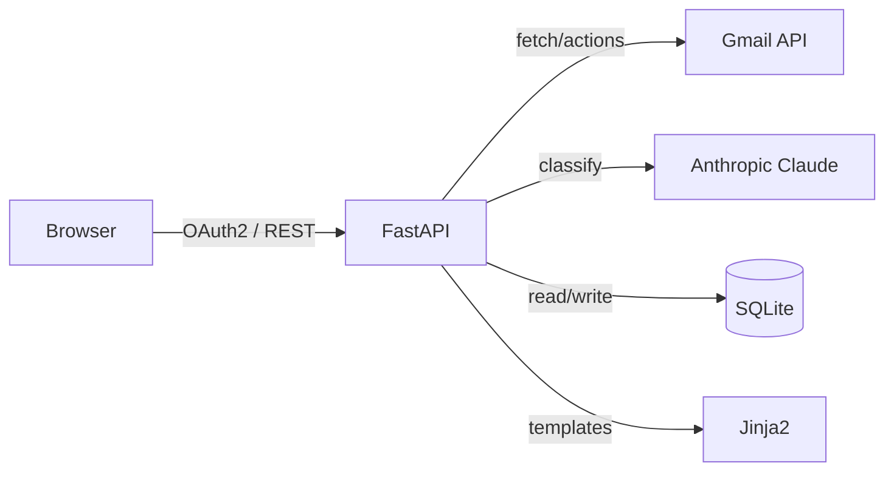

# Email Cleaner

A Python web app that connects to Gmail, categorizes your inbox with Claude AI, and lets you bulk delete, archive, move, save, and mark emails.

## Architecture



## Prerequisites

- Python 3.10+
- A Google account with Gmail
- An [Anthropic API key](https://console.anthropic.com/)

## Setup

### 1. GCP / Gmail credentials

1. Go to [console.cloud.google.com](https://console.cloud.google.com) and create a new project.
2. Navigate to **APIs & Services > Library**, search for **Gmail API**, and enable it.
3. Go to **APIs & Services > OAuth consent screen**:
   - Choose **External** user type.
   - Fill in the app name (e.g. "Email Cleaner"), support email, and developer contact.
   - Add the scope: `https://www.googleapis.com/auth/gmail.modify`
   - Under **Test users**, add your Gmail address.
4. Go to **APIs & Services > Credentials > Create Credentials > OAuth client ID**:
   - Application type: **Web application**
   - Authorized redirect URIs: `http://localhost:8000/auth/callback`
   - Click **Create**, then download the JSON file.
5. Save the downloaded file as `credentials.json` in the project root.

### 2. Configure environment

```bash
cp .env.example .env
```

Edit `.env` and fill in:

```
ANTHROPIC_API_KEY=sk-ant-...your-key...
SESSION_SECRET_KEY=any-long-random-string-here
```

### 3. Install dependencies

```bash
pip install -r requirements.txt
```

### 4. Run

```bash
python main.py
```

Open [http://localhost:8000](http://localhost:8000) in your browser.

## Usage

1. Click **Connect Gmail Account** and complete the Google OAuth flow.
2. Click **Fetch Emails** — this loads emails from your inbox and runs Claude AI to categorize them.
3. Emails are grouped into 7 categories: **Newsletters, Receipts, Work, Social, Notifications, Spam, Uncategorized**.
4. Select emails using checkboxes (or use **Select All** per category) and apply bulk actions:
   - **Delete** — moves to Gmail trash (recoverable)
   - **Archive** — removes from inbox, keeps in All Mail
   - **Move to...** — moves to a Gmail label of your choice
   - **Save to File** — exports email content as `.txt` files to `./saved_emails/`
   - **Mark Read / Unread**
5. Click **Fetch Emails** again to load more, or **Re-classify** to re-run AI on all cached emails.

### Keyboard shortcuts

| Shortcut | Action |
|----------|--------|
| `Ctrl+A` | Select all visible emails |
| `Escape` | Close modal or clear selection |

## Configuration

All settings are in `.env` (defaults shown):

| Variable | Default | Description |
|----------|---------|-------------|
| `ANTHROPIC_API_KEY` | — | Required. Your Anthropic API key. |
| `SESSION_SECRET_KEY` | — | Required. Random string for session signing. |
| `APP_PORT` | `8000` | Port the server listens on. |
| `EMAILS_PER_PAGE` | `50` | Emails fetched per "Fetch" call. |
| `CLASSIFIER_BATCH_SIZE` | `20` | Emails sent to Claude per API call. |
| `SAVE_DIR` | `./saved_emails` | Directory for saved email files. |
| `LOG_LEVEL` | `INFO` | Logging level (DEBUG, INFO, WARNING, ERROR). |
| `SESSION_MAX_AGE` | `3600` | Session timeout in seconds. |

## API Documentation

FastAPI auto-generates interactive API docs. When the app is running, visit:

- **Swagger UI**: [http://localhost:8000/docs](http://localhost:8000/docs)
- **ReDoc**: [http://localhost:8000/redoc](http://localhost:8000/redoc)

## Development

### Running tests

```bash
pip install -r requirements.txt
python -m pytest tests/ -v
```

### Linting and formatting

```bash
ruff check .
ruff format .
```

### File structure

```
email-cleaner/
├── main.py              # App entry point
├── config.py            # Settings and logging setup
├── database.py          # SQLite cache
├── gmail_client.py      # Gmail API + OAuth2
├── ai_classifier.py     # Claude classification
├── routers/             # FastAPI route handlers
│   ├── auth.py          # OAuth login/logout
│   ├── dashboard.py     # Dashboard page
│   └── emails.py        # Fetch, classify, bulk actions
├── templates/           # Jinja2 HTML templates
├── static/              # CSS + JS
├── tests/               # Pytest test suite
├── deploy/              # Production deployment configs
├── credentials.json     # Your GCP credentials (gitignored)
├── .env                 # Your secrets (gitignored)
├── Dockerfile
├── docker-compose.yml
└── requirements.txt
```

## Deployment

### Docker (development)

```bash
docker compose up --build
```

### Production

Use the production compose file with Caddy for automatic TLS:

```bash
cd deploy
DOMAIN=mail.yourdomain.com docker compose -f docker-compose.prod.yml up -d
```

Before deploying:

1. Update your GCP OAuth redirect URI to `https://mail.yourdomain.com/auth/callback`
2. Point your domain's DNS to the server
3. Place `credentials.json` and `.env` on the server

See [docs/ARCHITECTURE.md](docs/ARCHITECTURE.md) for detailed architecture documentation.

## Troubleshooting

| Problem | Solution |
|---------|----------|
| "Not authenticated" error | Delete `token.json` and re-login |
| OAuth redirect mismatch | Ensure `REDIRECT_URI` in GCP matches your `APP_PORT` |
| `credentials.json` not found | Download OAuth client JSON from GCP Console |
| Rate limit errors (429) | The app auto-retries; reduce `EMAILS_PER_PAGE` if persistent |
| Classification returns all "Uncategorized" | Check `ANTHROPIC_API_KEY` is valid and has credits |
| Token refresh fails | Delete `token.json`, re-authenticate |
| Database locked errors | Ensure only one instance of the app is running |
