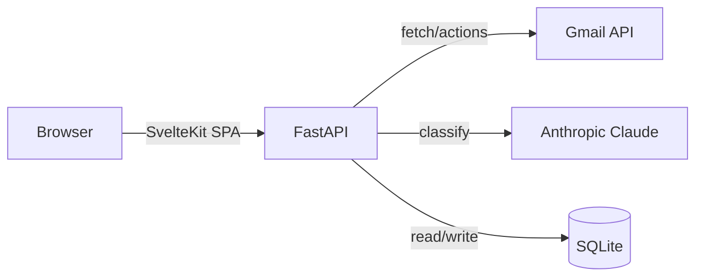

# Email Cleaner

A web app that connects to Gmail, categorizes your inbox with Claude AI, and lets you bulk delete, archive, move, save, and mark emails. SvelteKit frontend, FastAPI backend, SQLite database.

## Architecture



## Prerequisites

- Python 3.10+
- Node.js 18+
- A Google account with Gmail
- An [Anthropic API key](https://console.anthropic.com/)

## Setup

### 1. GCP / Gmail credentials

1. Go to [console.cloud.google.com](https://console.cloud.google.com) and create a new project.
2. Navigate to **APIs & Services > Library**, search for **Gmail API**, and enable it.
3. Go to **APIs & Services > OAuth consent screen**:
   - Choose **External** user type.
   - Fill in the app name (e.g. "Email Cleaner"), support email, and developer contact.
   - Add the scope: `https://www.googleapis.com/auth/gmail.modify`
   - Under **Test users**, add your Gmail address.
4. Go to **APIs & Services > Credentials > Create Credentials > OAuth client ID**:
   - Application type: **Web application**
   - Authorized redirect URIs: `http://localhost:8000/auth/callback`
   - Click **Create**, then download the JSON file.
5. Save the downloaded file as `credentials.json` in the project root.

### 2. Configure environment

```bash
cp .env.example .env
```

Edit `.env` and fill in:

```
ANTHROPIC_API_KEY=sk-ant-...your-key...
SESSION_SECRET_KEY=any-long-random-string-here
```

### 3. Install dependencies

```bash
# Backend
python3 -m venv venv
source venv/bin/activate
pip install -r requirements.txt

# Frontend
cd frontend
npm install
```

### 4. Run

```bash
npm run dev
```

This starts both the FastAPI backend (:8000) and Vite dev server (:5173). Open [http://localhost:5173](http://localhost:5173) in your browser.

For production:

```bash
npm run start   # builds frontend then starts FastAPI serving everything on :8000
```

## Usage

1. Click **Connect Gmail Account** and complete the Google OAuth flow.
2. Click **Fetch** to load emails from your inbox.
3. Click **Classify** to run Claude AI categorization.
4. Emails are grouped by category. Use the **Group by** and **then** dropdowns to change grouping (e.g., labels then sender domain).
5. Select emails using checkboxes and apply bulk actions:
   - **Delete** — moves to Gmail trash (recoverable for 30 days)
   - **Archive** — removes from inbox, keeps in All Mail
   - **Move to...** — moves to a Gmail label of your choice
   - **Save** — exports email content as `.txt` files
   - **Read / Unread** — toggle read status
6. Click **Categories** to manage AI classification categories and their descriptor items.
7. Click **Labels** to create, rename, or delete Gmail labels.

### Keyboard shortcuts

| Shortcut | Action |
|----------|--------|
| `Ctrl+A` | Select all visible emails |
| `Escape` | Close dialog or clear selection |

## Configuration

All settings are in `.env` (defaults shown):

| Variable | Default | Description |
|----------|---------|-------------|
| `ANTHROPIC_API_KEY` | — | Required. Your Anthropic API key. |
| `SESSION_SECRET_KEY` | — | Required. Random string for session signing. |
| `APP_PORT` | `8000` | Port the backend listens on. |
| `EMAILS_PER_PAGE` | `50` | Emails fetched per "Fetch" call. |
| `CLASSIFIER_BATCH_SIZE` | `20` | Emails sent to Claude per API call. |
| `SAVE_DIR` | `./saved_emails` | Directory for saved email files. |
| `LOG_LEVEL` | `INFO` | Logging level (DEBUG, INFO, WARNING, ERROR). |
| `SESSION_MAX_AGE` | `3600` | Session timeout in seconds. |

## API Documentation

FastAPI auto-generates interactive API docs. When the backend is running, visit:

- **Swagger UI**: [http://localhost:8000/docs](http://localhost:8000/docs)
- **ReDoc**: [http://localhost:8000/redoc](http://localhost:8000/redoc)

## Development

### Project structure

```
email-cleaner/
├── main.py              # FastAPI entry point, serves SPA
├── config.py            # Environment config and logging
├── database.py          # SQLite schema, CRUD, grouping
├── gmail_client.py      # Gmail API + OAuth2
├── ai_classifier.py     # Claude AI classification
├── routers/
│   ├── auth.py          # OAuth login/logout
│   ├── emails.py        # Fetch, classify, group, bulk actions
│   ├── categories.py    # AI category CRUD
│   └── labels.py        # Gmail label CRUD
├── frontend/            # SvelteKit SPA
│   ├── src/
│   │   ├── routes/      # Pages (dashboard, login)
│   │   └── lib/
│   │       ├── api/     # Typed API client
│   │       ├── stores/  # Svelte 5 reactive stores
│   │       ├── components/    # App components
│   │       └── components/ui/ # shadcn-svelte primitives
│   ├── svelte.config.js
│   └── package.json
├── tests/               # Pytest test suite
├── credentials.json     # GCP credentials (gitignored)
├── .env                 # Secrets (gitignored)
├── package.json         # Root scripts (dev, build, start)
└── requirements.txt     # Python dependencies
```

### Commands

```bash
npm run dev        # Start backend + frontend dev servers
npm run build      # Build SvelteKit SPA
npm run start      # Build + start production server

# Tests
pip install -r requirements.txt
python -m pytest tests/ -v

# Linting
ruff check .
ruff format .
```

## Deployment

### Docker (development)

```bash
docker compose up --build
```

### Production

Use the production compose file with Caddy for automatic TLS:

```bash
cd deploy
DOMAIN=mail.yourdomain.com docker compose -f docker-compose.prod.yml up -d
```

Before deploying:

1. Update your GCP OAuth redirect URI to `https://mail.yourdomain.com/auth/callback`
2. Point your domain's DNS to the server
3. Place `credentials.json` and `.env` on the server
4. Run `npm run build` to build the frontend

## Troubleshooting

| Problem | Solution |
|---------|----------|
| "Not authenticated" error | Delete `token.json` and re-login |
| OAuth redirect mismatch | Ensure redirect URI in GCP matches your `APP_PORT` |
| `credentials.json` not found | Download OAuth client JSON from GCP Console |
| Rate limit errors (429) | The app auto-retries; reduce `EMAILS_PER_PAGE` if persistent |
| Classification returns all "Uncategorized" | Check `ANTHROPIC_API_KEY` is valid and has credits |
| Token refresh fails | Delete `token.json`, re-authenticate |
| Frontend not loading | Run `npm run build` in `frontend/`, or use `npm run dev` for development |
