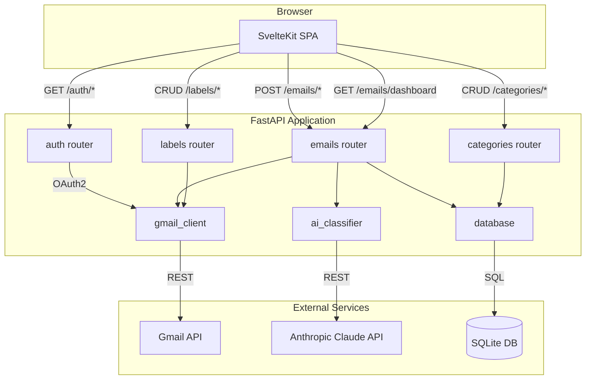
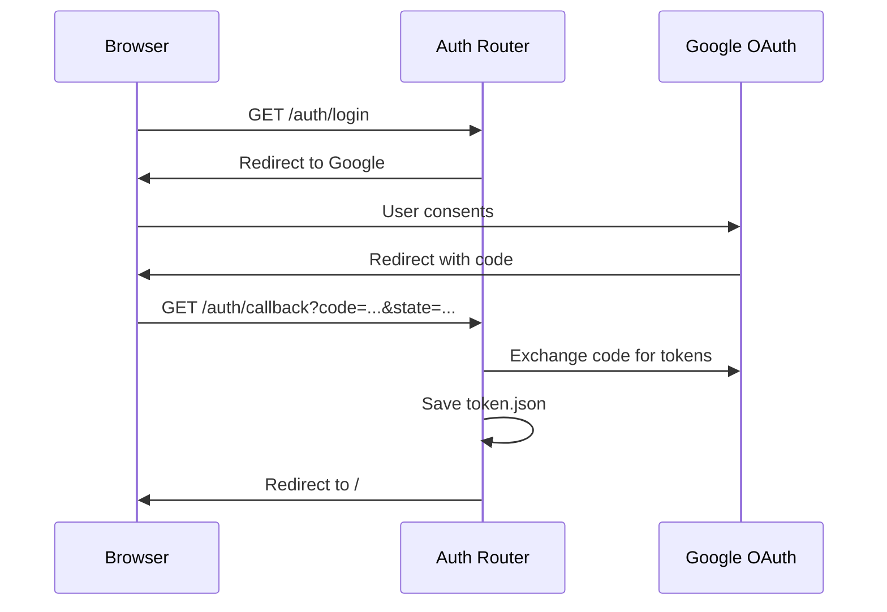
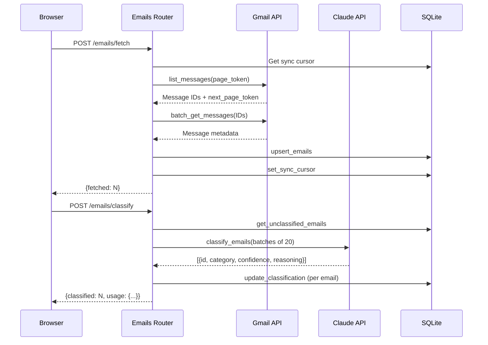
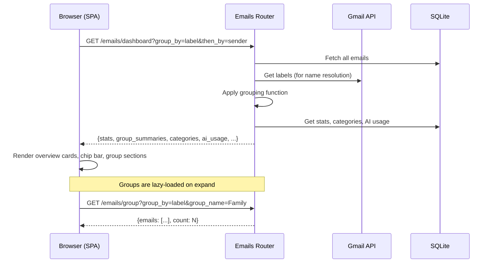

# Architecture

## System Overview

Email Cleaner is a single-user web application with a SvelteKit SPA frontend and a FastAPI JSON API backend. It connects to Gmail via OAuth2, classifies emails using Anthropic's Claude AI, and provides bulk management actions.

## Module Responsibilities

### `main.py`
Application entry point. Creates the FastAPI app, registers middleware (session, rate limiting), includes API routers, and serves the SvelteKit SPA build as static files.

### `config.py`
Loads environment variables from `.env` via python-dotenv. Exposes all application settings as module-level constants. Configures the structured logging system.

### `database.py`
Manages the SQLite database. Schema initialization, default category seeding, email CRUD, classification updates, category CRUD, grouping functions (7 dimensions), and aggregate statistics.

### `gmail_client.py`
Handles all Gmail API interactions. OAuth2 flow (authorization, token exchange, refresh), message listing and batch fetching, bulk modifications (trash, archive, move, mark), and label CRUD (create, rename, delete).

### `ai_classifier.py`
Interfaces with the Anthropic Claude API. Builds the classification prompt dynamically from database categories, processes emails in configurable batches, validates responses, and falls back to "Uncategorized" on errors.

### `routers/auth.py`
OAuth2 login flow: redirect to Google, process callback, save tokens, logout.

### `routers/emails.py`
Core API: fetching from Gmail, AI classification, dashboard data aggregation, email grouping (with nested sub-groups), and bulk actions (delete, archive, move, mark, save).

### `routers/categories.py`
CRUD for AI classification categories. Each category has a name, color, and comma-separated descriptor items that guide the AI classifier.

### `routers/labels.py`
CRUD for Gmail labels (create, rename, delete). Operates directly on the Gmail API.

### `frontend/`
SvelteKit SPA using Svelte 5 runes, shadcn-svelte components, and Tailwind CSS. Typed API client, reactive stores for selection/toast/loading state, and component-based UI.

## Data Flow

### Authentication

### Email Fetch and Classify

### Dashboard Load

## Database Schema

### `emails` table

| Column | Type | Description |
|--------|------|-------------|
| `id` | TEXT PK | Gmail message ID |
| `thread_id` | TEXT | Gmail thread ID |
| `sender` | TEXT | Sender display name |
| `sender_email` | TEXT | Sender email address |
| `subject` | TEXT | Email subject line |
| `snippet` | TEXT | Gmail-provided snippet |
| `date` | INTEGER | Unix timestamp of email date |
| `size_estimate` | INTEGER | Gmail size estimate in bytes |
| `is_read` | INTEGER | 0 = unread, 1 = read |
| `label_ids` | TEXT | JSON array of Gmail label IDs |
| `fetched_at` | INTEGER | Unix timestamp of last fetch |
| `category` | TEXT | AI-assigned category (NULL if unclassified) |
| `confidence` | REAL | AI confidence score 0.0-1.0 |
| `reasoning` | TEXT | AI explanation for classification |
| `classified_at` | INTEGER | Unix timestamp of classification |

### `categories` table

| Column | Type | Description |
|--------|------|-------------|
| `id` | INTEGER PK | Auto-increment ID |
| `name` | TEXT UNIQUE | Category name |
| `description` | TEXT | Comma-separated descriptor items for AI prompt |
| `color` | TEXT | CSS color value for UI display |
| `sort_order` | INTEGER | Display ordering |

### `sync_state` table

| Column | Type | Description |
|--------|------|-------------|
| `key` | TEXT PK | State key (e.g., `next_page_token`) |
| `value` | TEXT | State value |

### `ai_usage` table

| Column | Type | Description |
|--------|------|-------------|
| `id` | INTEGER PK | Auto-increment ID |
| `timestamp` | INTEGER | When the classification run occurred |
| `emails_count` | INTEGER | Emails classified in this run |
| `input_tokens` | INTEGER | Input tokens consumed |
| `output_tokens` | INTEGER | Output tokens consumed |
| `total_cost` | REAL | Estimated cost in USD |

## AI Classification

### Dynamic Prompt

The classifier builds its system prompt from the categories stored in the database. Each category's name and descriptor items are included. This means adding a new category (e.g., "Finance: invoices, bank statements, tax documents") immediately affects future classifications without code changes.

### Error Handling

- JSON parse failures: all emails in the batch fall back to "Uncategorized" with confidence 0.0
- API errors: same fallback behavior
- Invalid categories in response: mapped to "Uncategorized"
- Confidence values: clamped to [0.0, 1.0]

## Grouping System

Emails can be grouped by 7 dimensions, with optional nested sub-grouping:

| Dimension | Description |
|-----------|-------------|
| `category` | AI-assigned classification |
| `sender` | Sender domain (top 50, rest in "Other") |
| `date` | Date range buckets (Today, This Week, etc.) |
| `read_status` | Read vs Unread |
| `size` | Small / Medium / Large |
| `label` | Gmail labels (user-created only, "Unlabelled" for rest) |
| `frequency` | Top 50 senders by email count |

When label grouping is active, system labels (INBOX, CATEGORY_*, IMPORTANT, etc.) are filtered out and only user-created labels are shown. Emails with no user labels appear under "Unlabelled".

## Security Model

### Authentication
- Google OAuth2 with `gmail.modify` scope
- Authorization code flow with state parameter for CSRF protection
- Tokens stored in `token.json` on disk
- Automatic token refresh on expiry

### Session Management
- Starlette `SessionMiddleware` with signed cookies
- Configurable session timeout (`SESSION_MAX_AGE`, default 1 hour)

### Rate Limiting
- `slowapi` on `/emails/fetch` and `/emails/classify` (10 requests/minute)

### Input Validation
- Pydantic models validate all request bodies
- Email IDs validated against local database before forwarding to Gmail API

### Constraints
- **Single-user only**: one `token.json` and one shared database
- **No RBAC**: any authenticated user has full access
- **Local trust model**: designed to run on a trusted machine or behind a reverse proxy
