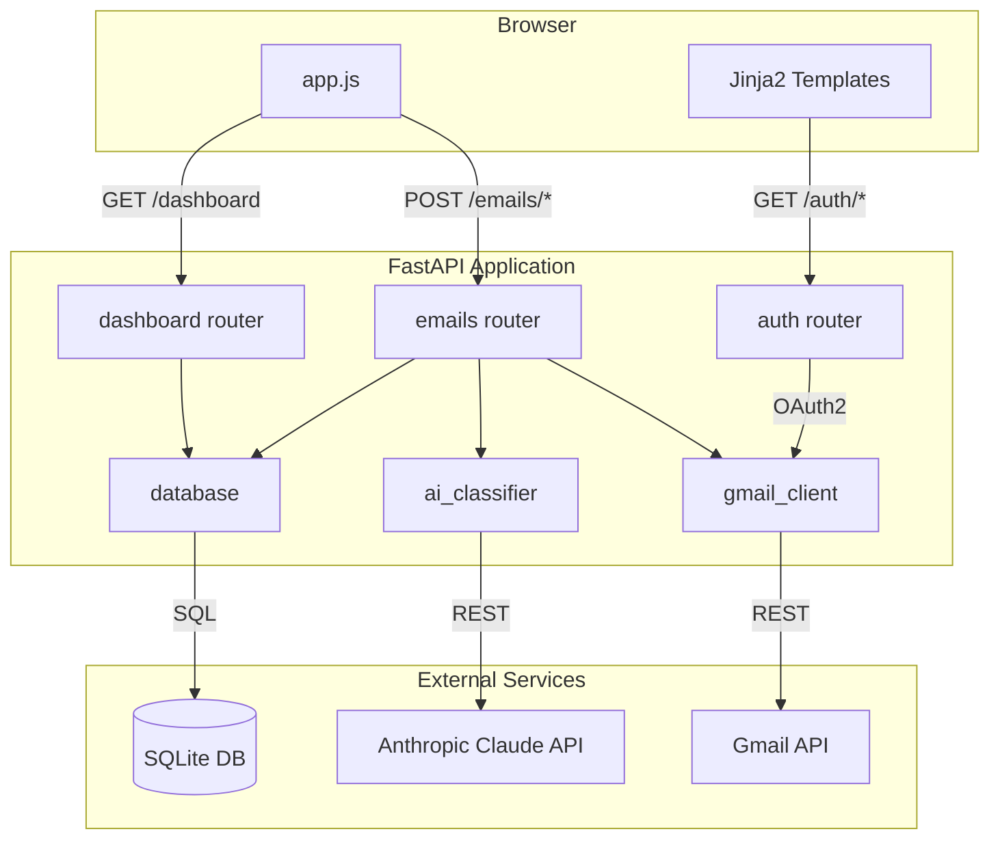
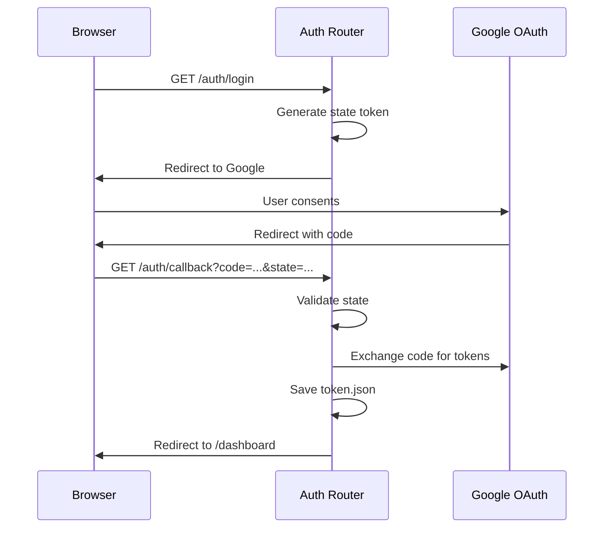
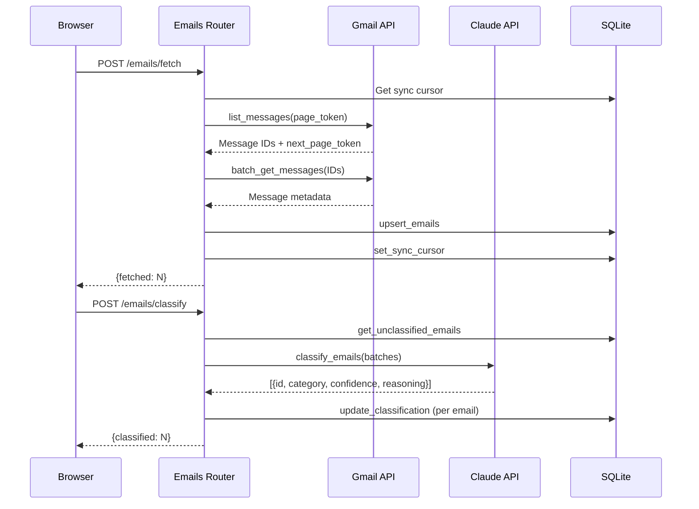

# Architecture

## System Overview

Email Cleaner is a single-user web application built with FastAPI that connects to Gmail via OAuth2, classifies emails using Anthropic's Claude AI, and provides bulk management actions. The app uses server-side rendering with Jinja2 templates and vanilla JavaScript for interactivity.

## Module Responsibilities

### `main.py`
Application entry point. Creates the FastAPI app, registers middleware (session, rate limiting), mounts static files, includes routers, and initializes the database on startup.

### `config.py`
Loads environment variables from `.env` via python-dotenv. Exposes all application settings as module-level constants. Configures the structured logging system used across all modules.

### `database.py`
Manages the SQLite database. Provides functions for schema initialization, email upsert/query/delete, classification updates, label management, read status tracking, sync cursor persistence, and aggregate statistics.

### `gmail_client.py`
Handles all Gmail API interactions. Manages OAuth2 flow (authorization URL generation, token exchange, credential refresh). Provides functions for listing messages, fetching metadata (via Batch API with sequential fallback), full message retrieval, and all modification actions (trash, archive, move, mark read/unread).

### `ai_classifier.py`
Interfaces with the Anthropic Claude API. Splits emails into configurable batch sizes, constructs classification prompts, parses JSON responses, validates categories, clamps confidence scores, and falls back to "Uncategorized" on any error.

### `routers/auth.py`
Handles the OAuth2 login flow: redirecting to Google, processing the callback, saving tokens, and logging out.

### `routers/dashboard.py`
Serves the main dashboard page. Loads all emails grouped by category, computes display formatting (dates, sizes, confidence percentages), and renders the Jinja2 template.

### `routers/emails.py`
API endpoints for all email operations: fetching from Gmail, running AI classification, listing/filtering emails, and executing bulk actions (delete, archive, move, mark, save). Includes rate limiting and input validation.

## Data Flow

### Authentication

### Email Fetch and Classify

## Database Schema

### `emails` table

| Column | Type | Description |
|--------|------|-------------|
| `id` | TEXT PK | Gmail message ID |
| `thread_id` | TEXT | Gmail thread ID |
| `sender` | TEXT | Sender display name |
| `sender_email` | TEXT | Sender email address |
| `subject` | TEXT | Email subject line |
| `snippet` | TEXT | Gmail-provided snippet |
| `date` | INTEGER | Unix timestamp of email date |
| `size_estimate` | INTEGER | Gmail size estimate in bytes |
| `is_read` | INTEGER | 0 = unread, 1 = read |
| `label_ids` | TEXT | JSON array of Gmail label IDs |
| `fetched_at` | INTEGER | Unix timestamp of last fetch |
| `category` | TEXT | AI-assigned category (NULL if unclassified) |
| `confidence` | REAL | AI confidence score 0.0-1.0 |
| `reasoning` | TEXT | AI explanation for classification |
| `classified_at` | INTEGER | Unix timestamp of classification |

### `sync_state` table

| Column | Type | Description |
|--------|------|-------------|
| `key` | TEXT PK | State key (e.g., `next_page_token`) |
| `value` | TEXT | State value |

## AI Classification

### Prompt Structure

The classifier sends batches of emails to Claude with a system prompt defining 7 categories and their criteria. Each email is represented as a JSON object with `id`, `from`, `subject`, and `snippet` (truncated to 300 characters). The model returns a JSON array with `id`, `category`, `confidence`, and `reasoning` for each email.

### Categories

| Category | Criteria |
|----------|----------|
| Newsletters | Marketing, digests, subscriptions, blog updates, promotions |
| Receipts | Order confirmations, invoices, payments, shipping notices |
| Work | Work communication, meetings, tasks, colleagues, clients |
| Social | Personal messages, social network notifications |
| Notifications | Automated alerts, account notifications, security alerts |
| Spam | Unsolicited, suspicious, phishing attempts |
| Uncategorized | Anything that doesn't fit the above |

### Error Handling

- JSON parse failures: all emails in the batch fall back to "Uncategorized" with confidence 0.0
- API errors: same fallback behavior
- Invalid categories in response: mapped to "Uncategorized"
- Confidence values: clamped to [0.0, 1.0]

## Security Model

### Authentication
- Google OAuth2 with `gmail.modify` scope
- Authorization code flow with PKCE-like state parameter for CSRF protection
- Tokens stored in `token.json` on disk
- Automatic token refresh on expiry

### Session Management
- Starlette `SessionMiddleware` with signed cookies
- Configurable session timeout (`SESSION_MAX_AGE`, default 1 hour)
- Session stores `logged_in` flag and OAuth state

### Rate Limiting
- `slowapi` rate limiter on `/emails/fetch` and `/emails/classify` (10 requests/minute)
- Prevents accidental API quota exhaustion

### Input Validation
- Pydantic models validate all request bodies
- Email IDs validated against local database before forwarding to Gmail API
- Label names validated as non-empty strings

### Constraints
- **Single-user only**: one `token.json` and one shared database
- **No RBAC**: any authenticated user has full access to all operations
- **Local trust model**: designed to run on a trusted machine or behind a reverse proxy
